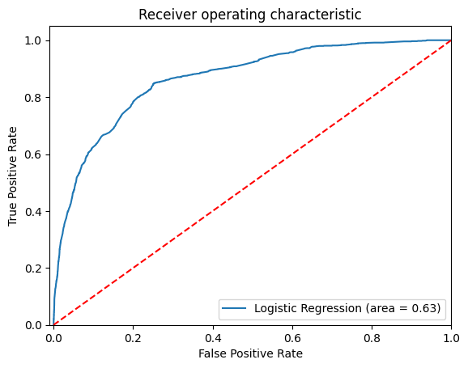

# **Data Analysis for Marketing Campaign**
---

## **Introduction**
### **Project Background**
In today's competitive market, customer loyalty is a key element in the success of businesses. To encourage their clients to stick around, more and more businesses are making efforts to implement loyalty programs, which may support them in making informed decisions. It is of paramount importance to identify the customer segments most responsive to marketing campaigns and adopt effective strategies for attracting more subscriptions to term deposits. This study develops statistical learning models, including both parametric and non-parametric to predict the success of a marketing campaign for a telecommunication company, as well as assist the company in making decisions.

For the company, there are several reasons why understanding which customer segments are most responsive to the marketing campaign is essential in optimizing the success of the campaign. First, these customer segments would spend more money on re-subscribe to a new term deposit, and less likely to switch to competitors. Therefore, the company may have a steadily income flow and less likely to be negatively influenced by economic downturns. Second, focusing on important customer segments may help the company attract new customers because loyal customers tend to recommend it to their relatives, friends, and colleagues. Finally, focusing on responsive segments will help minimize marketing cost, as well as maximize the return on investment. By building machine learning models, we can gain insights which can help guide the development of effective business strategies, contribute to allocate resources more efficiently and make data-informed decisions.

### **Project Objectives**
The main aims of this research are to predict customers’ likelihood of responding to marketing campaigns, and recommend some strategies for the telecommunication company to maximize campaign success as well as minimize costs.

Research questions: 
  1.	Which customer segments are most responsive to the company’s marketing campaign?
  2.	Can statistical learning models accurately predict the success of a marketing campaign?
  3.	How can the telecommunication company implement effective business strategies based on findings to maximize the marketing campaign success and overall business growth?

### **Dataset**
The [telemarketing campaign dataset](telecom_data.csv) contains a total of 22 variables. However, this project will take only 9 attributes into consideration.
- `age` is divided into 4 age groups, including Teen, Early Adulthood, Early Middle Age, and Late Middle Age.
- `duration` is divided into 4 groups: under 200s, 200-500s, 500-1000, and over 1000s.
The table below shows the attributes used for this project:

| Attributes  | Types        | Description                                 | Categories                                         |
|-------------|--------------|---------------------------------------------|--------------------------------------------------|
| Age group   | Categorical  | Age group of clients                       | Teen: 17 – 21, Early Adulthood: 22-34, Early Middle Age: 35-44, Late Middle Age: 45-69 |
| Marital     | Categorical  | Marital status                             | Married/Single/Divorced                          |
| Default     | Categorical  | Has credit in default?                     | Yes/No                                           |
| Housing     | Categorical  | Has a housing loan?                        | Yes/No                                           |
| Loan        | Categorical  | Has a personal loan?                       | Yes/No                                           |
| Contact     | Categorical  | Contact communication type                 | Cellular/Telephone                               |
| Duration    | Categorical  | Last contact duration                      | Under 200s, 200-500s, 500-1000s, Over 1000s     |
| Previous    | Numeric      | Number of contacts performed before this campaign | 0-7 contacts                               |
| Poutcome    | Categorical  | Outcome of the previous marketing campaign | Yes/No                                           |
| y           | Categorical  | Has the client subscribed a term deposit?  | Yes/No                                           |

### **Usage**
1. Upload the [dataset](telecom_data.csv) and [notebook](eda_and_models.ipynb) to your Google Drive.
2. Adjust file paths in the notebook file before running.

### **Models used**
- Logistic Regression
- Naïve Bayes
- KNN
- Support Vector Machince

### **Features**
- Conduct hyperparameter optimization by employing GridSearchCV to optimize the performance of Logistics Regression.
- Apply Cross Validation to help reduce overfitting and maximize data utilization.
- Confusion Matrix

### **Results**
**1. Which customer segments are most responsive to the company’s marketing campaign?**

Customers with **successful previous campaign outcome** and customers with **500-1000s last contact duration** are two customer segments that are more likely to respond positively to the telecommunication campaign. Customers in the 45-69 age group are also highly responsive. 

**2. Can statistical learning models accurately predict the success of a marketing campaign?**

The results turn out relatively good when 3 models have the accuracy of over 90%. Here are the results:

| Models                        | Accuracy Score | Average Accuracy (Cross-Validation) |
|-------------------------------|----------------|--------------------------------------|
| Logistic Regression           | 0.90508        |  0.90621                              |
| Naïve Bayes                   | 0.85464        | -                                   |
| K-Nearest Neighbors (KNN)     | 0.90188        | -                                   |
| Support Vector Machine (SVC)  | 0.91           | -                            |

Here is Confusion Matrix comparison table:

|                                 | **Meaning**                                                                 | **Logistic Regression** | **SVC** |
|-------------------------------------------|-------------------------------------------------------------------------------|--------------------------|---------|
| **True Positives**                         | Customers correctly predicted as potential customers and subscribed to the term deposit. | 10144                    | 10157   |
| **True Negatives**                         | Customers correctly predicted as NOT potential customers and did not subscribe to the term deposit. | 322                      | 270     |
| **False Positives**                        | Customers incorrectly predicted as potential subscribers, but they did not subscribe. | 163                      | 150     |
| **False Negatives**                        | Customers incorrectly predicted as NOT potential customers, but they did subscribe. | 867                      | 919     |
| **Total Correct Predictions**             |                                                                               | **10466**               | **10427** |
| **Total Incorrect Predictions**           |                                                                               | **1030**                | **1069**  |

- False Positives represent a wasteful cost on customers who did not subscribe to the term deposit. Therefore, it is necessary to analyse the characteristics of customers in this group to understand why they were misclassified, before implementing some strategies to minimize False Positives to reduce marketing costs. One strategy could be adjusting the campaign’s targeting to avoid customers who are potentially non-respondents.
  
- False Negatives represent customers were missed because the model failed to identify those who were interested in the campaign. This means the telecommunication company missed opportunity to attract potential customers, and increase revenue. Strategy could be refining models to make it more accurate, adopting appropriate strategies to focus on this group to capture more of these potential customers.

This is AUC ROC Curve of Logistic Regression model

**3. How can the telecommunication company implement effective business strategies based on findings to maximize the marketing campaign success and overall business growth?**

The company should specifically adopt marketing strategies for each customer segments, focus on most responsive groups to maximize the success of marketing campaign.
•	Regarding customers who subscribed to a term deposit in the past, the company should provide exclusive discounts, offerings, and rewards.
•	Regarding customers who show their interests in subscribing by spending their time on phone calls, it is a great chance to provide in-depth information about offerings, send personalized follow-up messages or emails, tailor message to their specific needs, and collect feedback directly from these customers.
•	In terms of the most responsive age group to the campaign, the company should implement appropriate strategies to encourage them and retain them as loyal customers.

## ** References**
Abu-Srhan, A., Alhammad, B., Al, S., & Al-Sayyed, R. (2019). Visualization and Analysis in Bank Direct Marketing Prediction. International Journal of Advanced Computer Science & Applications, 10(7). https://doi.org/10.14569/IJACSA.2019.0100785

Hossam, M., Predicting Loan Approval of Bank Direct Marketing Data Using Ensemble Machine Learning Algorithms. International Journal of Circuits, Systems and Signal Processing, vol. 14. https://doi.org/10.46300/9106.2020.14.117

Jiong, C., Yucen, H., Zhao, H., Yicheng, L. & Mengni, S. (2014). Who Will Subscribe A Term Deposit? Colombia University. http://www.columbia.edu/~jc4133/ADA- Project.pdf

Maia (2023, April 28). Customer Segmentation And Prediction For Marketing Campaigns. Medium. https://blog.startupstash.com/customer-segmentation- and-prediction-for-marketing-campaigns-3486f8dc2627

Moro, S., Cortez, P., & Rita, P. (2014). A data-driven approach to predict the success of bank telemarketing. Decision Support Systems, 62, 22-31. https://doi.org/10.1016/j.dss.2014.03.001

Olson, D. L., & Chae, B. (2012). Direct marketing decision support through predictive customer response modelling. Decision Support Systems, 54(1), 443- 451. https://doi.org/10.1016/j.dss.2012.06.005

Olson, D.L., Cao, Q., Gu, C. et al. Comparison of customer response models. Serv Bus 3, 117–130 (2009). https://doi.org/10.1007/s11628-009-0064-8

Raitaluoto, T. (2023, May 11). Segmenting customers based on their loyalty: pros and cons. markettailor. https://www.markettailor.io/blog/segmenting- customers-based-on-their-loyalty-pros-and-cons

